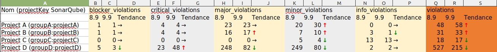

Tool to get a diff report (violations) between two instances of SonarQube.

NB : Report format is Excel's xlsx. Arrows characters display badly with Libreoffice.



Main usecase : 
- Compare ruleset impacts between SonarQube versions upgrade

Minimal set of options required :

```shell
-Dsonarqube.token=... 
-Dsonarqube.first-instance.host-url="http(s)://hostname:port" 
-Dsonarqube.second-instance.host-url="http(s)://hostname:port"
```

Minimal configuration :
- Java 17+
- Maven 3.5+
